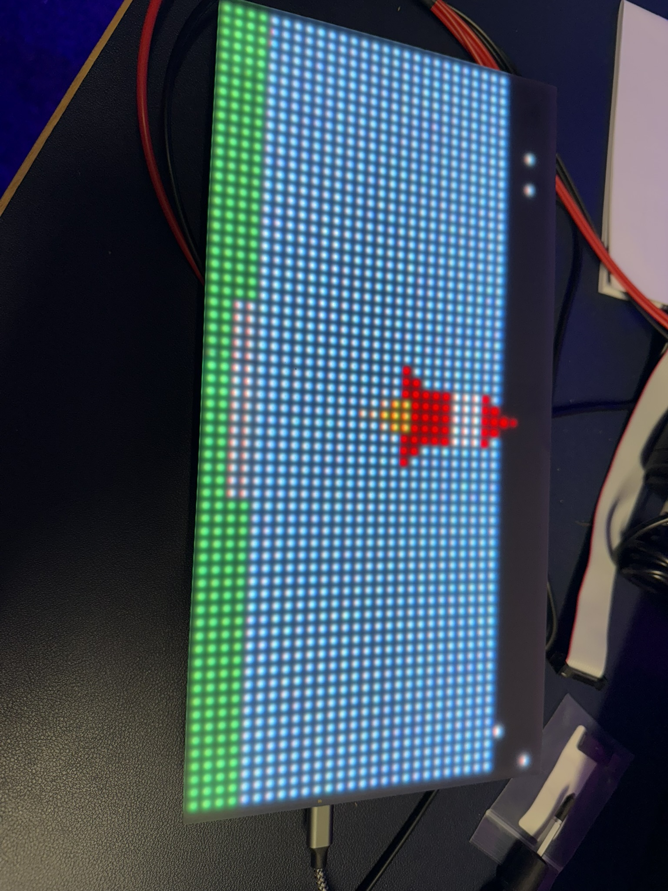
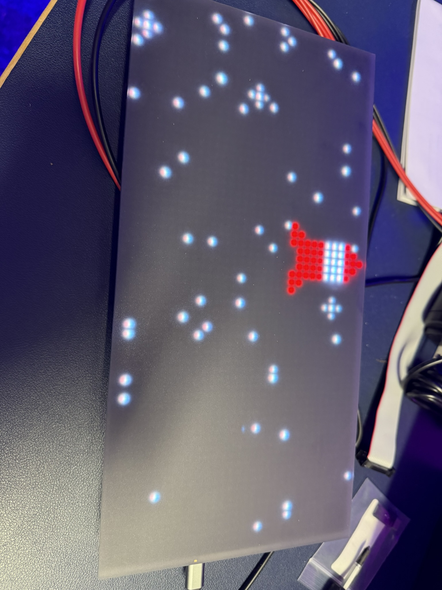
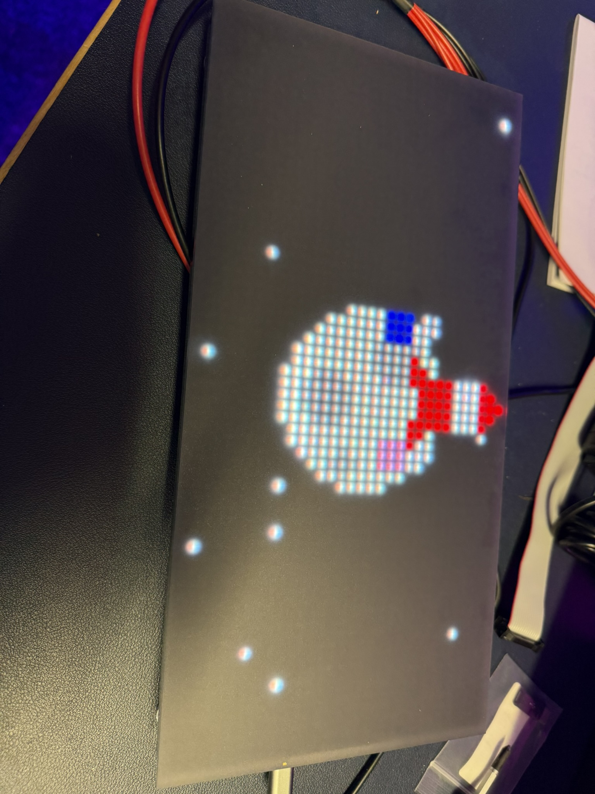
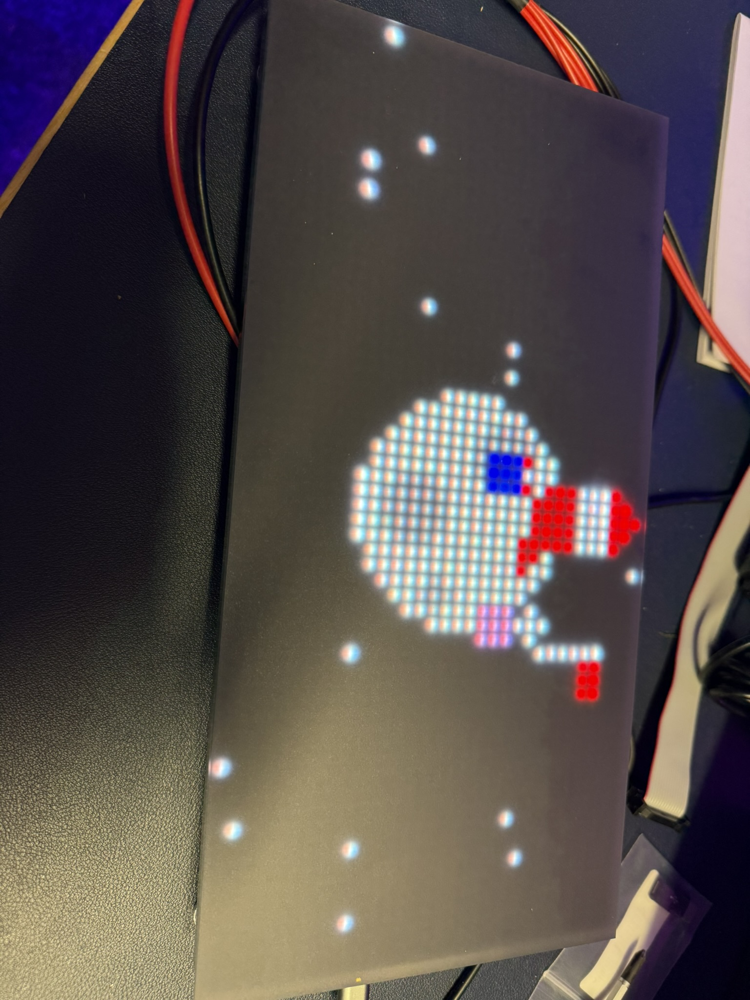

# Rocket Launch Animation for Matrix Portal M4

A stunning space journey animation for Adafruit Matrix Portal M4 with LED matrix displays, simulating a complete rocket launch, space travel, and moon landing sequence.



## Overview

This project creates a captivating animated sequence on a 64x32 RGB LED matrix, taking viewers through a complete space mission from countdown to flag planting on the moon. The animation runs in a continuous loop and features multiple distinct phases with smooth transitions.

## Animation Sequence

Watch the full animation in action:

<div align="center">
  <video width="640" height="360" controls>
    <source src="screenshots/IMG_8561.MP4" type="video/mp4">
    Your browser does not support the video tag.
  </video>
</div>

The animation proceeds through these phases:

1. **Countdown (6 seconds)** - Classic 5-4-3-2-1-0 countdown with large black numerals
   
   

2. **Launch (3 seconds)** - Rocket lifts off with the ground descending as space is revealed
3. **Space Travel (5 seconds)** - Rocket travels through star-filled space
4. **Moon Landing (4-5 seconds)** - Rocket descends to land on the moon's surface
   
   

5. **Astronauts (8 seconds)** - Two astronauts exit the rocket and bounce around on the moon
6. **Flag Planting (5 seconds)** - Astronauts move to plant a flag at the moon's edge
7. **Final Message (7-8 seconds)** - "ONE SMALL STEP FOR VON HOLTEN" scrolls in rainbow colors
   
   

Total animation cycle: ~40 seconds

## Hardware Requirements


### Components
- **Microcontroller**: Adafruit Matrix Portal M4
- **Display**: 64x32 RGB LED Matrix (4mm pitch recommended)
- **Power Supply**: 5V 4A (minimum) power supply with 2.1mm barrel jack

### Connections
The Matrix Portal M4 is designed to plug directly into the back of compatible RGB matrices, handling all the connections for you. Simply:

1. Connect the Matrix Portal M4 to the HUB75 input on the matrix
2. Connect power to the Matrix Portal M4's barrel jack
3. Optionally, connect a USB cable for programming and serial monitoring

## Features

- **Smooth Animation** - Consistent 20 FPS frame rate for fluid motion
- **Multiple Animation Phases** - Complete story from launch to moon landing
- **Realistic Details** - Rocket flames, astronaut physics, twinkling stars
- **8-bit Style Graphics** - Optimized for LED matrix display
- **Rainbow Text** - Color-shifting final message
- **Continuous Loop** - Seamless restart of the animation sequence

## Installation

### Software Setup
1. Install the Arduino IDE
2. Install the Adafruit Matrix Portal M4 board support:
   - Go to `File → Preferences` and add the following URL to Additional Boards Manager URLs:
     ```
     https://adafruit.github.io/arduino-board-index/package_adafruit_index.json
     ```
   - Go to `Tools → Board → Boards Manager` and install "Adafruit SAMD Boards"
3. Install required libraries through the Arduino Library Manager:
   - Adafruit Protomatter
   - Adafruit GFX
4. Select "Adafruit Matrix Portal M4" from the `Tools → Board` menu
5. Upload the `Rocket_launch_Rev3.ino` sketch to your Matrix Portal

### Hardware Assembly
1. Connect the Matrix Portal M4 to the HUB75 input connector on the matrix
2. Connect a 5V power supply to the Matrix Portal M4
3. The animation will begin automatically after upload

## Customization

The code is highly customizable:

- **Animation Timing**: Adjust the duration of each phase by changing the timing values in the phase transition conditions
- **Colors**: Modify the color definitions at the top of the sketch
- **Text Message**: Change the scrolling text in the `updateTextMessage()` function
- **Astronaut Suits**: Edit the colors in the `drawAstronauts()` function

## Code Structure

- **Main Functions**: Setup and loop routines with overall animation control
- **Animation Phases**: Separate update functions for each stage (`updateCountdown()`, `updateLaunch()`, etc.)
- **Drawing Functions**: Specialized functions for drawing rocket, astronauts, moon, etc.
- **Character Drawing**: Optimized 3x5 font rendering system

## Technical Details

- **Matrix Configuration**: 64x32 pixels, 4-bit color depth
- **Frame Rate**: 20 FPS (50ms delay between frames)
- **Color Depth**: 16-bit color (65,536 colors)
- **Memory Usage**: Optimized for the limited RAM of the Matrix Portal M4
- **Debug Mode**: Toggle `DEBUG_MODE` constant to enable/disable serial debugging

## License

This project is open source and available for educational and recreational purposes.

## Author

Created by VonHoltenCodes.